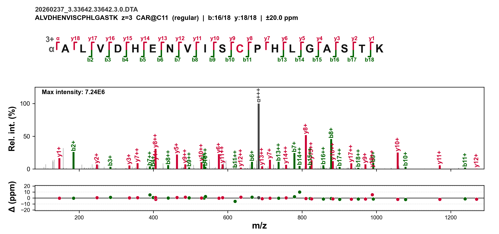
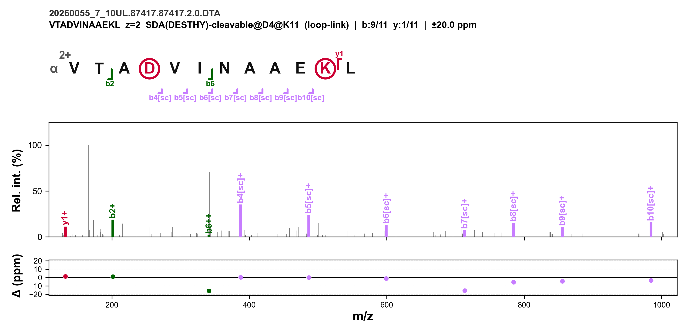
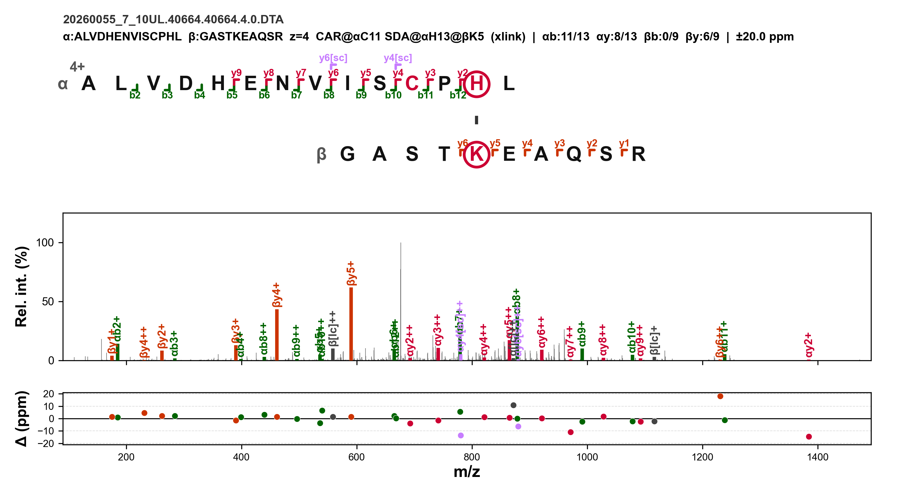

# SpectrumDrawer

MS/MS 谱图可视化工具，专为交联质谱 (Cross-Linking Mass Spectrometry, XL-MS) 数据分析设计。

从 pFind/pLink 或 pSimXL 的鉴定结果出发，自动生成带有序列图、谱图注释和质量误差面板的出版级 PNG 图片。








---

## 功能特性

- **多种谱图类型**：支持 regular（线性肽段）、mono-link（单端交联）、loop-link（环联）和 cross-link（交联）四种类型
- **可裂解交联剂**：支持 BDG-H、SDA(DESTHY) 等可裂解交联剂，自动识别 long arm / short arm 离子系列
- **非可裂解交联剂**：支持 BS3、DSS 等常规交联剂
- **多解析器支持**：支持 pLink (.plabel)、pSimXL (.csv) 和 pFind (.spectra) 三种鉴定格式
- **自动检测**：从 .plabel 文件名自动推断交联剂名称和谱图类型
- **大型 MGF 支持**：单次流式遍历提取，支持 200 MB – 2 GB+ 的大型 MGF 文件，内存占用极低
- **高速处理**：单次遍历 + 即时匹配，比旧版快约 3 倍（例：5.2 GB MGF / 257 张谱图仅需 2.1 分钟）
- **三面板输出**：
  - 序列梯子图（b/y 离子括号标注）
  - MS/MS 谱图（峰标注与离子着色）
  - 质量误差散点图（ppm 偏差）
- **前体离子匹配**：完整前体离子、可裂解臂前体离子、中性丢失变体
- **L-ladder 标注**：在每条链序列梯子最左端（yn 位置）标注完整链前体离子
- **中性丢失离子**：自动计算并标注带中性丢失的碎片离子
- **特殊离子标注**：支持亚胺离子 (immonium ions) 等特殊 m/z 离子的自动标注，颜色、容差可自定义
- **CSV 鉴定报告**：自动输出 `spectrum_coverage.csv`（b/y 离子覆盖率）与 `spectrum_relative_intensity.csv`（相对强度）；可裂解交联剂按普通 b/y、b/y[lc/sc]（独立）、合并三类统计；开启特殊离子时两个 CSV 末尾追加 `spint_*` 相对强度列
- **高度可配置**：通过 YAML 配置文件自定义颜色、字体、布局等所有视觉参数

---

## 环境要求

- Python >= 3.9
- numpy >= 1.21.0
- matplotlib >= 3.5.0
- pyyaml >= 6.0
- spectrum_utils >= 0.4.0

---

## 安装

### 方式一：pip 安装依赖

```bash
pip install -r requirements.txt
```

### 方式二：conda 环境

```bash
conda env create -f environment.yml
conda activate spectrumDraw
```

---

## 快速开始

### pSimXL 数据

```bash
python main.py --mgf spectra.mgf --ident results.csv --parser psimxl -o ./output/
```

### pLink 数据

```bash
# 常规肽段
python main.py --mgf spectra.mgf --ident results.regular.plabel --parser plink

# 单端交联（自动检测交联剂）
python main.py --mgf spectra.mgf --ident results.mono-linked.BS3.plabel --parser plink

# 交联肽段
python main.py --mgf spectra.mgf --ident results.cross-linked.BS3.plabel --parser plink
```

对于 pLink .plabel 文件，交联剂名称和谱图类型会从文件名中**自动推断**，无需手动指定 `--linker` 和 `--types`。

### pFind 数据

```bash
python main.py --mgf spectra.mgf --ident pFind-Filtered.spectra --parser pfind -o ./output/
```

pFind 解析器支持单肽段修饰鉴定结果（regular 类型），自动解析修饰信息。

### pLink 批量处理（快捷脚本）

当需要一次性处理 pLink3 搜索输出目录中**所有**结果时，使用 `scripts/batch_draw_plink.py`：

```bash
# 默认：cross-link + mono-link，DPI 100，8 进程
python scripts/batch_draw_plink.py D:\MSdata\...\pLink

# 开启所有四种类型 + 高 DPI
python scripts/batch_draw_plink.py D:\MSdata\...\pLink --loop-link --regular --dpi 300

# 自定义并行数
python scripts/batch_draw_plink.py D:\MSdata\...\pLink --workers 4
```

**脚本特性：**

- 自动从 `.plabel` 的 `[FilePath]` 段读取对应 MGF 路径（`.pf2` → `.mgf`）
- 自动跳过 `/tmps/` 中的中间结果文件
- 按 MGF 分组合并，同一 MGF 仅扫描一次（大幅减少磁盘 I/O）
- 多进程并行（默认 8 进程）
- 每种谱图类型独立开关：`--cross-link` / `--mono-link` / `--loop-link` / `--regular`（及对应 `--no-*` 关闭）

**输出结构：**

```
pLink/
├── BDG/
│   ├── cross-link_png/20260512_all_HCDFT/
│   ├── mono-link_png/20260512_all_HCDFT/
│   └── ...
├── SDA/
│   ├── cross-link_png/20260512_SDA_plus_HCDFT/
│   └── ...
└── ...
```

**性能参考** (140 plabel, 15 MGF, 8 workers, DPI=100, no-fallback):
总耗时 ~4.3 min，输出 ~5,650 张 PNG。

### 命令行参数

```
必需参数:
  --mgf, --spectrum       MGF 谱图文件路径
  --ident, --identification  鉴定结果文件路径 (.csv 或 .plabel)

可选参数:
  --parser        解析器名称 (默认: psimxl，可选: plink, pfind)
  -o, --out-dir   输出目录 (默认: ./output)
  -c, --config    自定义 YAML 配置文件路径
  --linker        交联剂名称 (pLink 模式下自动检测)
  --types         要绘制的谱图类型 (0=regular, 1=mono, 2=loop, 3=xlink)
  --tol           质量容差 ppm (覆盖配置文件)
  --max-charge    b/y 碎片离子最大电荷态 (默认: 2)
  --special-ions  要标注的特殊离子名称列表（逗号分隔，如 Gly,Ala,Leu），使用 "all" 标注全部
  --special-ions-file  自定义 special_ions.ini 文件路径
```

### 特殊离子标注

```bash
# 标注所有数据库中的亚胺离子
python main.py --mgf spectra.mgf --ident results.plabel --parser plink --special-ions all

# 只标注指定离子
python main.py --mgf spectra.mgf --ident results.plabel --parser plink --special-ions "Gly,Ala,Pro"

# 使用自定义数据库
python main.py --mgf spectra.mgf --ident results.plabel --parser plink --special-ions all --special-ions-file my_ions.ini
```

特殊离子数据库位于 `database/special_ions.ini`，每行格式为：

```
name=m/z,显示标签,颜色,ppm容差
```

例如：`Leu=86.097,Leu/Ile+,#8B4513,20.0`

注意：

- **short_name 必须全局唯一**（用作 CSV 列名与 `--special-ions` 选择标识），重复时后一条会覆盖前一条
- 匹配逻辑与 b/y 碎片离子一致：容差窗口内若有多个峰，取**相对强度最高**的峰
- 开启特殊离子时，两个 CSV 末尾各追加 `spint_<short_name>` 列（0~1 相对强度，与强度 CSV 归一化方式一致），未匹配的离子留空

### 特殊离子（报告离子）分析脚本

`scripts/special_ions/` 提供一套面向报告离子（特殊离子）的批量分析流水线，用于从 MGF / pParse / pLink 原始报告出发，完成扫描统计、定量与分层对比：

| 脚本                       | 职责                                                                                                                                     |
| -------------------------- | ---------------------------------------------------------------------------------------------------------------------------------------- |
| `scan_report_ions.py`      | 脚本 A：按 title 清单（或 `--all`）翻阅 MGF，统计报告离子的检出谱图数、绝对/相对强度与 TopN 相关峰                                       |
| `pparse_quant.py`          | 脚本 B：对 pParse 产物（.ms1/.ms2/.csv）做母离子-产物离子定量，输出每谱图宽表、检出率矩阵与 Ratio 分位数矩阵                             |
| `group_by_plink.py`        | 脚本 C：读 pLink 原始报告 CSV，按 `Peptide_Type`（mono-link/regular 等）分组并按多阈值 FDR 截断，输出各组的 title 清单                   |
| `compare_mono_regular.py`  | mono vs regular 分层对比：按各 FDR 阈值 title 集过滤逐谱图结果，按实验/对照文件前缀分层计算检出率（A 模式）与检出率+Ratio 分位（B 模式） |
| `special_ions_pipeline.py` | 统一入口：以 `--step a/b/c/all/compare` 编排上述脚本，透传各脚本参数                                                                     |

```bash
# 只跑脚本 C（pLink 分组 + FDR -> title 清单）
python scripts/special_ions/special_ions_pipeline.py --step c --plink-dir pLink --out-c out_c

# 用脚本 C 生成的 fdr100 title 集跑脚本 A（MGF 扫描）
python scripts/special_ions/special_ions_pipeline.py --step a --mgf-dir raw \
    --ions-file database/special_ions-jiangyida.ini \
    --titles-file out_c/BDG/mono_link.fdr100.titles.txt --out-a out_c_runs_fdr100/BDG_mono

# 分层对比（mode a 用脚本 A 结果；mode b 用脚本 B 结果）
python scripts/special_ions/special_ions_pipeline.py --step compare --compare-mode a \
    --runs-dir out_c_runs_fdr100 --out-c out_c --thresholds 0.10,0.50,1.00 --out-compare out_c_runs_fdr100
```

依赖：Python 3.9+（仅标准库，可选 pandas 输出 xlsx）。脚本 A/B/C 各自的参数与口径见各脚本文件头部的文档字符串。

---

## CSV 鉴定报告

默认开启（可通过 `report.enabled` 关闭），在输出目录生成两个 CSV：

| 文件                              | 内容                                                                                                    |
| --------------------------------- | ------------------------------------------------------------------------------------------------------- |
| `spectrum_coverage.csv`           | 每张谱图的 b/y 离子覆盖率（α/β 链，如`4/14`），可裂解交联剂另附 lc/sc 独立与合并统计，以及 α+β 总覆盖率 |
| `spectrum_relative_intensity.csv` | 每张谱图的 b/y 相对强度合计（按谱图最大强度归一化，0~1），同样分普通 / lc/sc / 合并三类                 |

统计口径：

- 覆盖率按**位点去重**：同一离子不同电荷态（b3+1 / b3+2）及中性丢失（b3\*）只算一个位点
- y 离子位点按 `n - i` 换算（y*i 与 b*{n-i} 切割位点相同），b/y 并集不会高估
- 相对强度位点内取最高强度，避免同一峰重复计数
- 开启特殊离子时两个 CSV 末尾追加 `spint_<short_name>` 列（0~1 相对强度）

---

## 输出示例

运行后在输出目录中生成 PNG 文件，每张图包含三个面板：

```
output/
  ├── Simulation.1.1.4.png
  ├── Simulation.2.2.4.png
  └── ...
```

文件名与谱图 TITLE 一致，便于与原始数据对应。

---

## 配置文件

默认配置位于 `config/default_config.yaml`，可通过 `-c` 指定自定义配置覆盖。

主要配置项：

| 分类            | 说明                                                                     |
| --------------- | ------------------------------------------------------------------------ |
| `figure`        | 图片尺寸、DPI、边距、面板比例                                            |
| `ladder`        | 序列梯子图布局（间距、字体、离子括号样式）                               |
| `spectrum`      | 谱图面板（峰线宽、匹配线宽、离子标签）                                   |
| `mass_error`    | 质量误差面板（散点大小、Y 轴范围）                                       |
| `colors`        | 各类离子颜色（b 离子、y 离子、可裂解离子等）                             |
| `processing`    | 处理参数（容差 ppm、离子类型、最大电荷态）                               |
| `report`        | 鉴定报告开关与文件名（enabled / coverage_filename / intensity_filename） |
| `modifications` | 固定/可变修饰名称列表                                                    |
| `crosslinker`   | 默认交联剂名称与质量                                                     |
| `title`         | 标题栏配置（字体大小、交联剂/修饰缩写长度）                              |

---

## 项目结构

```
SpectrumDrawer/
├── main.py                  # 命令行入口
├── config/
│   ├── config_manager.py    # YAML 配置加载与合并
│   └── default_config.yaml  # 默认配置
├── core/
│   └── spectrum_drawer.py   # 主流程调度（加载 → 匹配 → 绘制）
├── models/
│   ├── spectrum.py          # 谱图数据模型
│   └── identification.py    # 鉴定结果数据模型
├── report/
│   ├── fragment_stats.py    # 覆盖率 / 相对强度统计（含特殊离子强度）
│   └── csv_reporter.py      # CSV 报告写入（覆盖率 + 相对强度）
├── readers/
│   └── mgf_reader.py        # MGF 谱图文件读取
├── parsers/
│   ├── plink_parser.py      # pLink .plabel 格式解析
│   ├── psimxl_parser.py     # pSimXL CSV 格式解析
│   └── pfind_parser.py      # pFind .spectra 格式解析
├── database/
│   ├── aa.ini               # 氨基酸质量数据
│   ├── element.ini          # 元素单同位素质量
│   ├── modification.ini     # 修饰质量数据
│   ├── xlink.ini            # 交联剂定义
│   ├── special_ions.ini     # 特殊离子（如亚胺离子）数据库
│   ├── residues.py          # 残基质量（懒加载）
│   ├── modifications.py     # 修饰质量（懒加载）
│   ├── ini_loader.py        # INI 文件解析器
│   └── atomic_mass.py       # 原子质量（懒加载）
├── utils/
│   ├── ion_calculator.py    # 理论 b/y/a/c/z 离子 m/z 计算
│   ├── fragment_matcher.py  # 理论碎片与观测峰匹配
│   └── proforma_utils.py    # ProForma 字符串构建与修饰字典
├── draw/
│   ├── figure_composer.py   # 图形组装（三面板布局）
│   ├── ladder_panel.py      # 序列梯子图绘制
│   ├── spectrum_panel.py    # 谱图 stick 图绘制
│   └── mass_error_panel.py  # 质量误差散点图绘制
├── scripts/
│   ├── batch_draw_plink.py  # pLink3 批量谱图绘制快捷脚本
│   └── batch_draw_pfind.py  # pFind 批量谱图绘制快捷脚本
└── test/
    ├── test_input/          # 测试数据
    └── output/              # 测试输出
```

---

## 支持的交联剂

交联剂定义在 `database/xlink.ini` 中，可以使用pFind/pLink的相关文件替换，当前测试文件包含：

| 交联剂      | 类型     | 说明                             |
| ----------- | -------- | -------------------------------- |
| BS3         | 非可裂解 | 常规胺基反应交联剂               |
| BDG-H       | 可裂解   | 带 long arm / short arm 裂解特征 |
| SDA(DESTHY) | 可裂解   | 光反应交联剂，可裂解             |

如需添加新交联剂，在 `xlink.ini` 中按现有格式添加条目即可。

---

## 支持的修饰

修饰定义在 `database/modification.ini` 中（源自 pLink 数据库）。

- **固定修饰**：通过 `config/default_config.yaml` 的 `modifications.fixed` 配置，默认对 C 添加 Carbamidomethyl
- **可变修饰**：从鉴定数据中自动识别（如 Oxidation[M]）

---

## 已知限制

- 当前仅支持 MGF 格式谱图文件
- 仅支持 b/y 型碎片离子（a/c/z 离子计算已实现但未接入绘图）

---

## 版本

当前版本：**v0.4.0** (Beta)

### 更新日志

**v0.4.0**

- 新增α/β-chain完整链前体离子的标注
- 新增特殊报告离子的额外处理脚本，支持pLink3输出文件

**v0.3.0**

- 新增 CSV 鉴定报告：自动输出 `spectrum_coverage.csv`（b/y 离子覆盖率）与 `spectrum_relative_intensity.csv`（相对强度，按谱图最大强度归一化），通过 `report.enabled` 配置控制，默认开启
- 开启特殊离子时，两个 CSV 末尾追加 `spint_<short_name>` 相对强度列（0~1），列名取自 ini 的 short_name
- 特殊离子匹配逻辑与 b/y 碎片离子统一：容差窗口内取相对强度最高的峰

**v0.2.1**

- 新增最大强度标注功能：在质量误差面板中显示最大强度的峰
- 增加 `output.max_per_file` 配置项，限制每个文件绘制的谱图数量（默认 5000 个），防止大文件占用空间过大
- 新增pFind批量绘图脚本

**v0.2.0**

- 新增特殊离子标注功能：支持亚胺离子 (immonium ions) 等特殊 m/z 离子的自动标注，质量误差面板使用菱形标记区分
- 新增 `database/special_ions.ini` 数据库文件，预置 20 种常见氨基酸亚胺离子
- 新增 `--special-ions` 和 `--special-ions-file` CLI 参数
- 新增pLink批量绘图脚本，多线程并行+减少读取次数，大幅度提升绘图效率

**v0.1.2**

- 大型 MGF 文件支持（200 MB – 2 GB+）：单次流式遍历，内存占用降低 90%+

**v0.1.1**

- 新增 pFind 解析器支持
- 交联谱图标题栏分别显示 α/β 链覆盖率，标题栏过长时自动缩放字体
- 交联剂和修饰缩写长度可配置（默认 3 字符）
- 修复 pSimXL 交联位点索引转换（0-based → 1-based）

**v0.1.0**

- 初始测试版本
- 支持 pLink 和 pSimXL 解析器
- 支持 regular、mono-link、loop-link、cross-link 四种谱图类型
- 支持可裂解和非可裂解交联剂

---

## 许可证

本项目仅供科研与学术用途。
