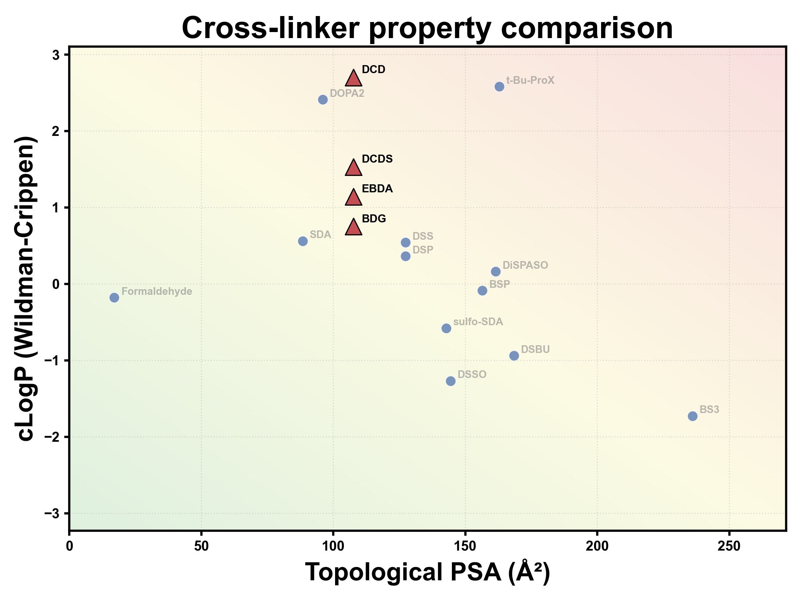

# CrosslinkerProps — 交联剂水溶性 / 透膜性预测与比较

独立小工具：输入新交联剂的名称与 SMILES，计算 **tPSA（Ų）** 与 **cLogP** 等理化性质，
按经验阈值给出水溶性 / 透膜性定性预测，并与常见交联剂绘制比较图、导出汇总 CSV。

依赖：`rdkit`、`matplotlib`、`numpy`、`pandas`、`pyyaml`（推荐 Python 3.13 环境）。

## 快速开始

```bash
cd scripts/CrosslinkerProps
py -3.13 crosslinker_props_cli.py ^
    --xlinker "BDG=CC1(N=N1)CNC(CCCC(NCC2(N=N2)C)=O)=O" ^
    --xlinker "EBDA=CC1(N=N1)CCC(NCCNC(CCC2(N=N2)C)=O)=O" ^
    --xlinker "DCD=CC1(N=N1)CCNC(CCCCCCC(NCCC2(N=N2)C)=O)=O" ^
    --xlinker "DCDS=CC1(N=N1)CCNC(CCCC(NCCC2(N=N2)C)=O)=O"
```

输出：

```
===== 本次输入的交联剂预测结果 =====
  名称  tPSA(Ų)  cLogP     MW  HBD  HBA 水溶性(预测) 透膜性(预测)
 BDG    107.64   0.75 266.31    2    6       高      中等
EBDA    107.64   1.14 280.33    2    6       中      中等
 DCD    107.64   2.70 336.44    2    6       中      中等
DCDS    107.64   1.53 294.36    2    6       中      中等
```

- **汇总 CSV**：`test/xlinkers_output.csv`（含 12 个常见 + 4 个已收录测试交联剂 + 本次输入，utf-8-sig）
- **比较图**：`test/xlinkers_comparison.png`（默认输出目录 `test/` 已被 .gitignore 忽略）

## 测试结果展示

以下为 4 个新型光交联剂（BDG / EBDA / DCD / DCDS）与常见交联剂的比较图：
tPSA 与 cLogP 越小（越靠左下）越好；常见交联剂为灰色标注，已收录测试剂为橙色三角，
本次输入为红色大三角（可加 `--legend` 在图内显示图例）。



## CLI 参数

| 参数                    | 说明                                   |
| ----------------------- | -------------------------------------- |
| `--xlinker NAME=SMILES` | 交联剂名称与 SMILES，可多次使用        |
| `-o, --out-dir`         | 输出目录（默认`test/`）                |
| `-c, --config`          | 自定义 YAML 配置                       |
| `--no-plot`             | 不绘制比较图                           |
| `--legend`              | 在图内绘制图例（默认关闭）             |
| `--init-data`           | 由内置列表重建参考数据表`xlinkers.csv` |

## 参考数据表

`xlinkers.csv` 保存已知交联剂的名称、SMILES、tPSA、cLogP、分子量、HBD、HBA 与
`is_common`（1 = 常见，0 = 不常见）。描述符始终由 SMILES 重算（SMILES 为权威），
数据表缺失时由内置列表自动生成，内置列表更新后可执行 `--init-data` 重建。

## 交联剂引文与测试层级

测试层级指该交联剂在对应文献中的验证环境：**纯化蛋白**（体外/纯化复合物）、
**裂解液**（细胞裂解物）、**细胞原位**（完整细胞 / 活细胞 / 完整细胞器 / in situ）。
每个层级均依据对应文献中该交联剂实际做过的实验判定（见引文后的括注）；多个引文只保留最主要的前三个。

| 交联剂                | 类型               | 测试层级（依据文献）                   | 引文（≤3，括注为层级判断依据）                                                                                                                                                                                                                                                                                                                                                                                                                                                                   |
| --------------------- | ------------------ | -------------------------------------- | ------------------------------------------------------------------------------------------------------------------------------------------------------------------------------------------------------------------------------------------------------------------------------------------------------------------------------------------------------------------------------------------------------------------------------------------------------------------------------------------------ |
| BS3                   | 化学               | 纯化蛋白（膜不可渗透）                 | [Staros, _Biochemistry_ 1982, 21:3950](https://doi.org/10.1021/bi00260a008)（原始试剂，hydrophilic / membrane-impermeant 蛋白交联剂）；[Kolbowski et al., _Anal. Chem._ 2017, 89:5311, 10.1021/acs.analchem.6b04935](https://doi.org/10.1021/acs.analchem.6b04935)（BS3 交联 HSA / 肌酸激酶 / 肌红蛋白，纯化蛋白）                                                                                                                                                                               |
| DSS                   | 化学               | 纯化蛋白 + 裂解液 + 细胞原位           | [Ryl et al., _J. Proteome Res._ 2020, 19:327, 10.1021/acs.jproteome.9b00541](https://doi.org/10.1021/acs.jproteome.9b00541)（DSS 原位交联人线粒体，5518 个距离约束）；[Cao et al., _Mol. Syst. Biol._ 2026, 10.1038/s44320-026-00222-9](https://doi.org/10.1038/s44320-026-00222-9)（8 个纯化蛋白/复合物 + 酵母核糖体 + _E. coli_ / HEK293T 裂解液）                                                                                                                                             |
| DSBU                  | 化学（可裂解）     | 纯化蛋白 + 裂解液                      | [Pan et al., _Anal. Chem._ 2018, 10.1021/acs.analchem.8b02593](https://doi.org/10.1021/acs.analchem.8b02593)（BSA 纯化蛋白）；[Ihling et al., _J. Am. Soc. Mass Spectrom._ 2020, 10.1021/jasms.9b00008](https://doi.org/10.1021/jasms.9b00008)（BSA + _E. coli_ 核糖体 + 果蝇胚胎提取物/裂解液）                                                                                                                                                                                                 |
| DSSO                  | 化学（可裂解）     | 纯化蛋白（复合物）+ 细胞原位           | [Kao et al., _Mol. Cell. Proteomics_ 2011, 10.1074/mcp.M110.002212](https://doi.org/10.1074/mcp.M110.002212)（DSSO 开发并交联酵母 20S 蛋白酶体，纯化复合物）；[Wang et al., _Mol. Cell. Proteomics_ 2017, 16:840, 10.1074/mcp.M116.065326](https://doi.org/10.1074/mcp.M116.065326)（DSSO **in vivo** + in vitro 交联人 26S 蛋白酶体）                                                                                                                                                           |
| DSP                   | 化学（可裂解）     | 纯化蛋白 + 细胞原位                    | [Lomant &amp; Fairbanks, _J. Mol. Biol._ 1976, 104:243, 10.1016/0022-2836(76)90011-5](<https://doi.org/10.1016/0022-2836(76)90011-5>)（纯化血红蛋白交联）；[Akaki et al., _Bio-protocol_ 2022, 12:e4478, 10.21769/BioProtoc.4478](https://doi.org/10.21769/BioProtoc.4478)（活细胞内 DSP 交联）                                                                                                                                                                                                  |
| 甲醛                  | 化学               | 细胞原位（完整细胞悬液）               | [Klockenbusch &amp; Kast, _J. Biomed. Biotechnol._ 2010, 10.1155/2010/927585](https://doi.org/10.1155/2010/927585)（Jurkat 细胞 / 人血小板完整细胞甲醛交联后 IP-MS）                                                                                                                                                                                                                                                                                                                             |
| DOPA2                 | 化学（醛）         | 纯化蛋白（复合物）                     | [Wang et al., _Biophysics Reports_ 2022, 8:239, 10.52601/bpr.2022.220014](https://doi.org/10.52601/bpr.2022.220014)（纯化瞬时二聚体复合物 EIN/HPr、EIIAGlc/EIIBGlc）                                                                                                                                                                                                                                                                                                                             |
| BSP                   | 化学（三功能）     | 细胞原位                               | [Zhao et al., _Nat. Commun._ 2025, 16:10725, 10.1038/s41467-025-65752-6](https://doi.org/10.1038/s41467-025-65752-6)（in situ 完整细胞 26S 蛋白酶体核/质分区 XL-MS）；[Zhou et al., _JACS Au_ 2025, 5:3649, 10.1021/jacsau.5c00709](https://doi.org/10.1021/jacsau.5c00709)（in vivo 数据比较分析）                                                                                                                                                                                              |
| t-Bu-ProX（tBu-PhoX） | 化学（可富集）     | 细胞原位（体内）                       | [Jiang et al., _Angew. Chem. Int. Ed._ 2022, 61:e202113937, 10.1002/anie.202113937](https://doi.org/10.1002/anie.202113937)（tBu-PhoX 开发，完整 HEK293T 细胞 / 小鼠心脏线粒体 / 枯草芽孢杆菌体内交联）；[Zhou et al., _JACS Au_ 2025, 5:3649, 10.1021/jacsau.5c00709](https://doi.org/10.1021/jacsau.5c00709)（已发表 in vivo 数据系统评估）                                                                                                                                                    |
| DiSPASO               | 化学（可裂解）     | 纯化蛋白 + 细胞原位                    | [Müller et al., _Commun. Chem._ 2025, 8:191, 10.1038/s42004-025-01568-1](https://doi.org/10.1038/s42004-025-01568-1)（Cas9-Halo 纯化蛋白 + 纯化核糖体 + HEK293 活细胞三层级测试）                                                                                                                                                                                                                                                                                                                |
| SDA                   | 光                 | 纯化蛋白 + 细胞原位                    | [Walker-Gray et al., _PNAS_ 2017, 114:10414, 10.1073/pnas.1701782114](https://doi.org/10.1073/pnas.1701782114)（**SDA** 活细胞内光交联 PKA 亚基）；[Iyer et al., _Mol. Pharm._ 2015, 12:3237, 10.1021/acs.molpharmaceut.5b00183](https://doi.org/10.1021/acs.molpharmaceut.5b00183)（SDA 标记纯化肌红蛋白）                                                                                                                                                                                      |
| sulfo-SDA             | 光（磺化）         | 纯化蛋白（膜不可渗透，无细胞原位报道） | [Müller et al., _Anal. Chem._ 2019, 91:9041, 10.1021/acs.analchem.9b01339](https://doi.org/10.1021/acs.analchem.9b01339)（sulfo-SDA 变pH交联 HSA / 细胞色素 c，纯化蛋白）；[Belsom et al., _Wellcome Open Res._ 2016, 1:24, 10.12688/wellcomeopenres.10129.1](https://doi.org/10.12688/wellcomeopenres.10129.1)（CASP11 盲测，纯化蛋白靶标）；[Pompach et al., _Front. Endocrinol._ 2019, 10:695, 10.3389/fendo.2019.00695](https://doi.org/10.3389/fendo.2019.00695)（IGF-1:Imp-L2 纯化复合物） |
| BDG                   | 光（双 diazirine） | 纯化蛋白 + 细胞原位                    | [Jiang et al., _Nat. Commun._ 2026, 17:6558, 10.1038/s41467-026-73272-0](https://doi.org/10.1038/s41467-026-73272-0)（BSA / 重组 HSP90β 纯化蛋白 + HeLa 活细胞 BDG 光交联）                                                                                                                                                                                                                                                                                                                      |
| EBDA                  | 光（双 diazirine） | 纯化蛋白                               | [Zheng et al., _Commun. Biol._ 2026, 9:128, 10.1038/s42003-025-09407-8](https://doi.org/10.1038/s42003-025-09407-8)（BSA、人 importin 复合物、登革 NS2B–NS3 蛋白酶复合物，均为纯化体系）                                                                                                                                                                                                                                                                                                         |
| DCD                   | 光（双 diazirine） | 纯化蛋白 + 裂解液                      | [Xie et al., _Anal. Chem._ 2025, 97:5488, 10.1021/acs.analchem.4c04939](https://doi.org/10.1021/acs.analchem.4c04939)（BSA / catalase / 溶菌酶等纯化蛋白 + _E. coli_ 70S 核糖体 + _E. coli_ 细胞裂解液，无活细胞实验）                                                                                                                                                                                                                                                                           |
| DCDS                  | 光（双 diazirine） | 待补充（自合成，暂无文献）             | —                                                                                                                                                                                                                                                                                                                                                                                                                                                                                                |

> 注：
>
> 1. t-Bu-ProX 在文献中的正式名称为 **tBu-PhoX**（tert-butyl disuccinimidyl phenyl phosphonate）。
> 2. sulfo-SDA 因含磺酸基为水溶性、膜不可渗透，文献中未见细胞原位（活细胞）应用。
> 3. DCDS 为本项目组自合成交联剂，尚无公开文献，引文与测试层级待补充。

## 预测原理

- **tPSA**：拓扑极性表面积（Ertl 方法，RDKit `Descriptors.TPSA`），单位 Ų
- **cLogP**：Wildman-Crippen 脂水分配系数（RDKit `Crippen.MolLogP`）
- **水溶性**：由 cLogP 推断（cLogP 越小越易溶于水，默认 ≤1 高、≤3 中等）
- **透膜性**：由 tPSA 推断（被动扩散经验值，默认 ≤90 Ų 良好、≥140 Ų 差）

阈值与绘图样式（字体、纵轴范围、配色、渐变底色等）均可在 `default_config.yaml` 中调整。

## 文件结构

| 文件                     | 说明                                     |
| ------------------------ | ---------------------------------------- |
| crosslinker_props.py     | 主程序：描述符计算、预测、绘图、CSV 导出 |
| crosslinker_props_cli.py | CLI 调度程序                             |
| default_config.yaml      | 配置文件（阈值、输出、绘图样式）         |
| xlinkers.csv             | 交联剂数据表                             |
| test/                    | 默认输出目录（已 gitignore）             |
