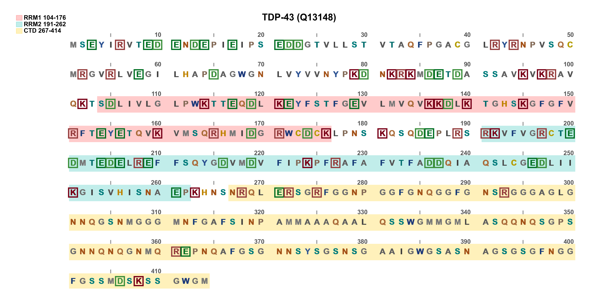

# SequenceDrawer

独立小工具：根据用户输入的序列，生成视觉直观的序列标注图。
每行默认 50 个残基，每 5 个残基一个小灰标记、每 10 个残基一个数字标记；
残基按理化性质默认配色（可覆盖）；支持结构域色带 + 图注、以及按范围/按氨基酸类型对残基做边框、下划线、加粗、阴影等强调。

运行环境：Python 3 + matplotlib + pyyaml（仓库 requirements 已包含）。



---

## 基本用法

```bash
# 用序列文件（FASTA / 纯序列均可，自动忽略 > 头与空白）
python3 scripts/SequenceDrawer/sequence_drawer_cli.py scripts/SequenceDrawer/tdp43.fasta \
    -o scripts/SequenceDrawer/test_output

# 或直接给序列字符串
python3 scripts/SequenceDrawer/sequence_drawer_cli.py "MSEYIRVTED..." -o test_output
```

`-o/--out-dir` 输出目录**必须指定**。未给 `--title` 时，默认标题为"前 10 个残基…（序列长度）"。

## 结构域标注

```bash
python3 scripts/SequenceDrawer/sequence_drawer_cli.py tdp43.fasta -o test_output \
    --title "TDP-43 (Q13148)" \
    --domain RRM1:104:176 --domain RRM2:191:262 --domain CTD:267:414
```

- `--domain NAME:START:END` 可多次使用，渲染为半透明色带，图注（legend）画在图的左栏
- 不需要图注时加 `--no-legend`（左栏可整体裁掉）

## 残基强调

支持两种指定方式，可多次使用、可叠加：

1. **按位置范围**（绝对序号，含边界）：
   - `--box 104-176` / `--box 104-176,200` 加边框
   - `--underline 191-262` 加下划线
   - `--bold 267-290` 超级加粗
   - `--shadow 100-110` 加阴影

2. **按氨基酸类型**（不用自己找位点）：
   - `--emphasize KRDE` 给所有 K/R/D/E 加边框
   - `--emphasize-underline KR` 给所有 K/R 加下划线
   - `--emphasize-bold FWY` 给所有 F/W/Y 加粗
   - `--emphasize-shadow KRDE` 给所有 K/R/D/E 加阴影

边框、下划线颜色默认跟随残基本身颜色（如 K/R 用棕红色框）。

## 单残基改色

```bash
--color 50=#FF0000        # 第 50 号残基改红色
--color 50=D=#0000FF      # 仅当第 50 号残基是 D 时才改蓝色（防误用）
```

## 其他常用参数

```bash
--start 50                # 序列第一个残基的序号（默认 1）
--residues-per-line 60    # 每行残基数（默认 50）
--font-size 14            # 残基字母字号
--format svg              # png / svg / pdf（默认 png）
--dpi 200                 # 输出 DPI（默认 300）
--name myfig              # 输出文件名（默认取标题）
-c my_config.yaml         # 自定义 YAML 配置（覆盖默认配置）
```

## 常用配置参数（scripts/SequenceDrawer/default_config.yaml）

| 参数                                                      | 含义                                                                                   |
| --------------------------------------------------------- | -------------------------------------------------------------------------------------- |
| `layout.residues_per_line`                                | 每行残基数（默认 50）                                                                  |
| `layout.number_interval` / `tick_interval`                | 数字标记 / 小灰标记间隔（默认 10 / 5）                                                 |
| `layout.block_gap`                                        | 每 10 个残基后留空的格子数                                                             |
| `layout.residue_gap`                                      | 相邻残基格子间距（给边框/下划线留空间）                                                |
| `number_line.tick_len`                                    | 小灰标记长度                                                                           |
| `domain.band_height`                                      | **结构域色带高度**（相对格高，默认 2.0；想更宽改大，如 2.2~2.4，注意别顶到上方编号行） |
| `domain.band_alpha`                                       | 色带透明度                                                                             |
| `style.color_darken`                                      | 字母颜色加深系数（<1 越深）                                                            |
| `style.letter_extra_bold`                                 | 全体字母额外加粗                                                                       |
| `highlight.box_pad` / `box_width`                         | 边框大小 / 线宽                                                                        |
| `highlight.box_match_residue` / `underline_match_residue` | 边框/下划线颜色是否跟随残基本身颜色                                                    |
| `font.size` / `font.family`                               | 字母字号 / 字体（默认 Arial 加粗）                                                     |

## 测试

- 序列数据：`tdp43.fasta`（TDP-43, Q13148）
- 输出目录：`test_output/`（已在 .gitignore 中忽略）
- 演示 TDP-43 的 CTD 缺少 KRDE 等带电/极性残基：

```bash
python3 scripts/SequenceDrawer/sequence_drawer_cli.py scripts/SequenceDrawer/tdp43.fasta \
    -o scripts/SequenceDrawer/test_output \
    --title "TDP-43 (Q13148)" \
    --domain RRM1:104:176 --domain RRM2:191:262 --domain CTD:267:414 \
    --emphasize KRDE
```

全部命令行参数见 `python3 scripts/SequenceDrawer/sequence_drawer_cli.py --help`。
